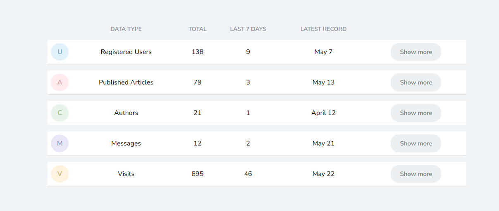

This project was actually our 4th assignment given to us in the Introduction to Web Development Course 
but I edited and made some changes to it, because when it was previously submitted I received feedback 
saying it had minor alignment issues but now i have made sure to fix them, the only challenging aspects
of the code was adding the hamburger icon to the page when it is shrunk or minimized replacing the 
navigation bar, all that remains is the javascript to make the hamburger icon resposinve.
In the head tag is where all the meta tags, links to stylesheets and title of the webpage go.
```
 <head>
<meta charset="utf-8">
<meta name="viewport" content="width=device-width, initial-scale=1">
<meta name="author" content="Nifemi Leye">
<meta name="description" content="Nifemi Leye: Web Developer">
<meta name="keywords" content="web developer, web, developer, front-end, html, css, javascript, react, sql">
<title>HTML and CSS Based Table</title>
<link rel="icon" href="./img/faviconratio.jpg" type="image/x-icon">
 <link rel="stylesheet" href="https://cdnjs.cloudflare.com/ajax/libs/font-awesome/6.4.2/css/all.min.css" integrity="sha512-z3gLpd7yknf1YoNbCzqRKc4qyor8gaKU1qmn+CShxbuBusANI9QpRohGBreCFkKxLhei6S9CQXFEbbKuqLg0DA==" crossorigin="anonymous" referrerpolicy="no-referrer">
<link rel="stylesheet" href="./assets/style/index.css" media="all">
 <link rel="stylesheet" href="./assets/style/reset.css" media="all">
</head>
```

In the header is where the navigation bar for the webpage is made.
```
<header>
    <div class="container">
        <h1>Project 1</h1>

        <nav>
            <ul>
                <li><a href="#">Home</a></li>
                <li><a href="#">About Us</a></li>
                <li><a href="#">Contact Us</a></li>
            </ul>
        </nav>
        <div class="collapse nav icon">
            <i class="fa-solid fa-bars"></i>
        </div>
    </div>        
</header>
```


The css involving the styling of the header is shown below, the background colour used and how the items where aligned.
```
header {
    height: 60px;
    background-color: #682cc0;
}

header div {
    width: 80%;
}

div h1 {
    position: absolute;
    text-align: left;
    left: 0;
    top: 0;
    padding-left: 170px;
}

h1 {
    font-size: 18px;
    font-weight: 600;
    color: #fff;
    letter-spacing: 0.2px;
    line-height: 60px;
}

.container > nav {
    padding-right: 16px;
    position: absolute;
    right: 0;
    top: 0;
    text-align: left;
    width: 80%;
}

nav ul {
    font-size: 0;
    list-style-type: none;
}

nav ul li {
    display: inline;
    line-height: 60px;
}

nav ul li a {
    display: inline-block;
    padding: 0 15px;
    font-size: 15px;
    color: #fff;
    text-decoration: none;
    transition: all 0.5s ease-in-out;
}

nav ul li a:hover {
    border-radius: 5px;
    background-color: #bc3ee0;
    color: #000000;
}
```


The main also resides in the body where the table itself is made.
Below is the css involved for the structure of the table, also showing how it was centered. 

```
form {
    display: flex;
    margin-top: 30px;
    font-size: 0;
}

input {
    display: block;
    border-radius: 20px;
    position: absolute;
    right: 0;
    margin-right: 140px;
    margin-top: 7px;
    top: 0;
    text-align: right;
}

input[type=text] {
    text-align: left;
    height: 46px;
    padding: 0 20px 0 32px;
    background: #9b7cc8 url(../img/search.png) no-repeat 10px 14px;
    background-size: 15px;
    font-size: 17px;
    width: 220px;
    background-color: #5925a3;
    font-size: 15px;
    cursor: text;
}

::placeholder {
    color: #baa6d9;
}

.center {
    margin-left: auto;
    margin-right: auto;
    place-items: center;
}

table {
    height: 52vh;
    margin-top: 120px;
    width: 65%;
    border-collapse: separate;
    border-radius: 10px;
}

th {
    color: #888d97;
    font-size: 14px;    
    padding: 2px;
}

td {
    padding: 8px;
    border-bottom: 1px solid #ddd;
    background-color: #fff;
    text-align: center;
}

div {
    border-radius: 50%;
    padding: 10px 2px;
}

.U {
    background-color: #e2f2fd;
    border: 1px transparent #e2f2fd;
    color: #4faad2;
}

.A {
    background-color: #ffebee;
    border: 1px transparent #ffebee;
    color: #de8f90;
}

.C {
    background-color: #e8f4e9;
    border: 1px transparent #e8f4e9;
    color: #8db876;
}

.M {
    background-color: #e8e7f8;
    border: 1px transparent #e8e7f8;
    color: #7b86ca;
}
```

